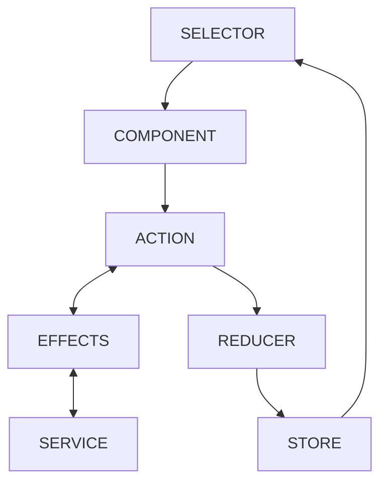
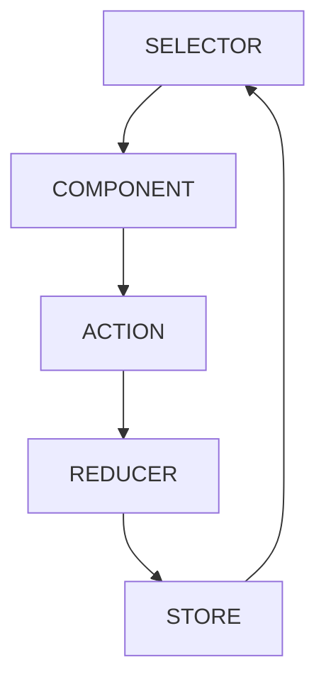

# Notes

[Angular Course with NgRx](https://www.youtube.com/watch?v=vcfZ0EQpYTA)

## Standalone Components

Previously we had modules and components. That is why: - `app.component.ts` - `app.module.ts`

and if we are creating some feature, then we had to create another module example and register separate components.

Now, Angular **Standalone components** were introduced. Thus, ng-modules are now optional which means we can create new features just with components without using modules. This requires much less code to create new features.

## NgRx

Ref: [ngrx.io](https://ngrx.io/guide/store)

### Why NgRx

Inside Angular, we doesn't have a lot of things to manage our state. We just have components, services, etc.

If we want two or more services to communicate to each other then we need to add dependency injections and write functions to return the requested response.

The problem here is that, we don't have any strict rules what we write inside or how they are woking which essentially means all of our angular code is just:

- some properties inside components.
- some properties or methods inside services.

This means the code is not scalable and does not follow standard structure.

Solution:

[Redux](https://redux.js.org/) which is a predictable state container for JavaScript apps. This is a global state of data, outside of our framework, and just in a strict way, we can use it. Every popular framework is using Redux within.

But inside Angular, we are not using Redux directly, we are using [NgRx](https://ngrx.io/guide/store).

### What is NgRx

NgRx is just a wrapper around Redux to implement it correctly for Angular. _Implementing Redux the way Angular likes it_!

It is a framework to build **Reactive applications** in Angular.

The main problem with NgRx (Redux) is that we have to write a lot of Boilerplate.

### NgRx State Management Lifecycle



Whenever a **Component** does some **Action** e.g. user clicked on submit button then the **Action** _changes the State_ in the **Reducer** which changes the **Store** (which depicts our _global state_) and when our state is changed then the components who are _subscribed_ to this state will be notified about state changes.

#### What are Effects?



This is the part of **NgRx** which is synchronous and works without **Effects**. Essentially Effects are not needed for _synchronous actions_ inside NgRx. Effects is an additional library for NgRx in order to make API calls to Backend. We need Effects when we have background operations to be done. Thus, in order for Effects to work, we need to have the structure:

- **Start**: API to start with
- **Success**: Success state of this API
- **Failure**: Failure state of thie API

### Installing NgRx

```shell
npm install @ngrx/store
```

### Installing Effects

```shell
npm install @ngrx/effects@latest
```

## Project Structure

```
/app
    /article
        /components
        /store                                          -> Related of NgRx
        /types                                          -> Types those are only visible within article feature
        /service                                        -> Services those are only visisible within article feature.
        article.routes
    /globalFeed                                         -> Name of the feature or component
        /components
            /globalFeed                                 -> Name of the component (child component)
        globalFeed.routes                               -> Routes for this component.
    /shared                                             -> To share common content accorss all our features
        /components
            /backendErrorMessages
                backendErrorMessages.component.ts
            /popularTags
                /types                                  -> Now everything within /types is not visible outside.
                /store
                popularTags.component.ts
        /types
            article.interface.ts
        /services
            article.services.ts
    app.routes                                          -> To manage all our routes accross the application
main.ts                                                 -> Entry point of our application
```

Features **article** and **globalFeed** can be initialized only via a route.

But all shareable components (within `/shared` directory) can be initialized directly.

## Why Lazy Loading

Inside a single routing: `app.routes.ts` we have bundled everything in this file. Thus, Lazy loading helps us to split our application and make every single chunk smaller and our application faster.

## Development Tools

- Install [Redux Dev Tools](https://chrome.google.com/webstore/detail/redux-devtools/) Chrome extension.

- Install new **NgRx** library: [store-devtools](https://ngrx.io/guide/store-devtools)

```shell
npm install @ngrx/store-devtools
```

## What is Reducer

This is just a function where we are defining how actions are changing our state.

**NOTE**:

We can't mutate `state`:

```ts
const authFeature = createFeature({
  //...
  reducer: createReducer(
    //...

    // Below arrow method simply returns a new state.
    // as we have in-fact return a new object.
    on(register, (state) => ({...state, isSubmitting: true}))
  ),
});
```

We can't do `state.[SOME_PROPERY] = [SOMETHING]`. Because, we have Redux and in fact Redux and Redux Dev-Tools are working in a way where we are always returning a new state thereby allowing Redux to compare the new state with the old state and thus understands that our state was changed.

## Points to Remember

- If we want to include links on our web-pages we must import `RouterLink` in our component.
